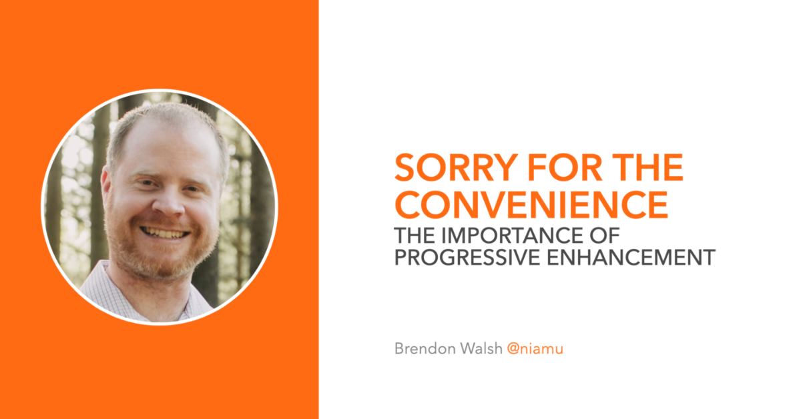

# Sorry For The Convenience

## The Importance of Progressive Enhancement

A talk I gave at [Dutch Clojure Days](https://clojuredays.org) 2022. [Watch the recording](https://www.youtube.com/watch?v=Tds4uHdf7Zk).

See the (progressively enhanced) slides: [niamu.github.io/sorry-for-the-convenience](https://niamu.github.io/sorry-for-the-convenience)
